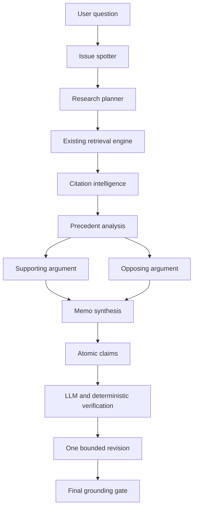
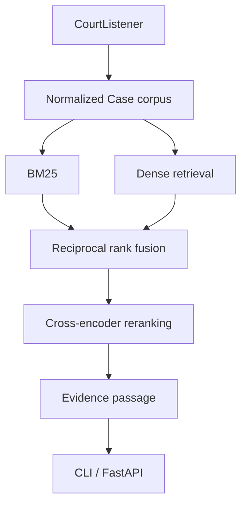
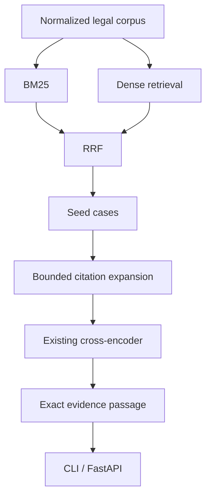

# LexTrace

**Litigation Argument Intelligence**

Trace every argument. Test every authority. Find the weakness before opposing
counsel does.

Start with the [synthetic product walkthrough](docs/v2-demo.md) for the full
Matter-to-monitoring flow, or follow [Run locally](#run-locally) to launch the
API and web workspace. LexTrace is an engineering prototype over a local,
incomplete corpus; its findings require lawyer review.

LexTrace v2 adds a private Matter Workspace and Argument X-Ray for litigation
documents. Upload a PDF, DOCX, TXT, or Markdown brief; inspect legal issues and
claims against their exact source spans; resolve cited reporter references into
the local case corpus; and compare cited passages with independently discovered
support and counter-authority. Each finding exposes its evidence and research
gaps. A lawyer can edit a proposition, dismiss an irrelevant claim, pin or remove
an authority, and rerun one claim without reprocessing the whole document.

The claim detail now adds **Precedent Trace + Authority Intelligence + Doctrine
Evolution v1**: a bounded view of earlier and later citation links, a federal
court-hierarchy relationship to the Matter forum, recovered citation context,
conservative treatment labels, and an evidence-backed timeline. A lawyer can
confirm, reject, or mark treatment uncertain without changing the raw citation
edge. Relevance, hierarchy, treatment, and argument impact remain separate.

**Deep Research + Red Team + Evidence Matrix v2** adds a transparent coverage
assessment, typed research gaps, a lawyer-approved bounded search plan, and a
separate adversarial check. The matrix is the central claim review surface and
exports structured references as CSV. Coverage refers only to the local index;
attack severity is not a prediction of a court's decision. See
[Deep Research architecture and limits](docs/v2-deep-research.md).

LexTrace turns a legal question into a bounded research plan, retrieves exact
passages from real judicial decisions, inspects citation relationships, drafts
competing analyses, and verifies every substantive claim against run-local
evidence. It exposes the complete safe trace through a CLI, FastAPI, and a focused
research workspace rather than a generic chat interface. The existing research
and search tools remain available at `/research` and `/search`; matters are the
home page.

The system combines CourtListener ingestion, BM25 and dense retrieval, reciprocal
rank fusion, citation expansion, cross-encoder reranking, LangGraph orchestration,
claim-level verification, SQLite runtime persistence, version-safe structured
caching, and a Next.js frontend. It does not claim comprehensive legal relevance
or replace professional legal advice.

## Matter Workspace demo

Build a local index first, then start both services with `docker compose up
--build`. Open `http://localhost:3000`, create a matter, and upload a small legal
document. Analysis runs in a bounded background job; it requires
`OPENAI_API_KEY` and `LEXTRACE_LLM_MODEL` in your local ignored `.env`. Search and
matter creation do not need an LLM key. Uploaded documents and their local
structured cache live under the private runtime directory, not the public case
corpus. Deleting a matter removes its files and analysis records when no job is
active. See [Argument X-Ray architecture and privacy](docs/v2-argument-xray.md).
See [Precedent intelligence rules and coverage](docs/v2-precedent-intelligence.md)
before relying on a treatment or authority category.

## Setup

Use Python 3.12:

```sh
python3.12 -m venv .venv
source .venv/bin/activate
python -m pip install -e '.[dev,retrieval,research]'
pre-commit install
```

The health API and CLI help require no credentials. Ingestion requires a
CourtListener API token exported as `COURTLISTENER_API_TOKEN`. See `.env.example`;
`.env` files are not automatically loaded.

### Local private inference with Ollama

LexTrace can run structured Matter, research, and monitoring judgments through
an Ollama model on the same host. Install Ollama, run `ollama pull qwen3:8b`,
start its service, and set:

```sh
export LEXTRACE_LLM_PROVIDER=ollama
export LEXTRACE_LLM_MODEL=qwen3:8b
export OLLAMA_BASE_URL=http://127.0.0.1:11434
export LEXTRACE_LLM_TIMEOUT=180
```

With local LexTrace services, local corpus/Matter storage, and host-local
Ollama, Matter text need not go to a paid remote LLM provider. The
OpenAI-compatible provider remains available by setting
`LEXTRACE_LLM_PROVIDER=openai-compatible`, `OPENAI_API_KEY`, and a model ID.
Ollama calls use schema-constrained JSON, deterministic sampling, an 8,192-token
context limit, bounded output, and disabled thinking output. Local inference
still consumes machine memory and compute time.

The Docker backend uses `OLLAMA_DOCKER_BASE_URL`, defaulting to
`http://host.docker.internal:11434`, independently of the host-process
`OLLAMA_BASE_URL`. The host daemon must listen on an address reachable from
Docker. The frontend and backend images do not contain the Ollama model. For a daemon
bound only to `127.0.0.1`, run the backend directly on the host instead.

## Run locally

```sh
uvicorn lextrace.api.app:app --reload
curl http://127.0.0.1:8000/health
lextrace --help
```

The endpoint returns `{"status":"ok"}`.

For the complete demo, first build or supply the ignored local index and graph,
then start both services:

```sh
docker compose up --build
# Research workspace: http://localhost:3000
# Backend health:     http://localhost:8000/health
```

Images contain no corpus, index, graph, model cache, credential, or runtime
database. Compose mounts `artifacts/` read-only and stores runtime/cache data in
named volumes. See [Engineering v1 operations](docs/engineering-v1.md).

## Grounded legal research workflow

The research layer orchestrates the existing retrieval engine and citation graph;
it does not own indexes or graph storage. Install the `research` extra, export an
API-compatible credential and an explicit model ID, then run:

```sh
export OPENAI_API_KEY='<provider-key>'
export LEXTRACE_LLM_MODEL='<structured-output-model-id>'
lextrace research "employee fired after discussing salary" \
  --index artifacts/indexes/default --graph artifacts/graphs/default \
  --jurisdiction ca2 --as-of 2026-01-01
```

Add `--json` for the complete typed response. `POST /research` accepts the same
question, jurisdiction, date, and case bound. Prompts use versioned definitions;
retrieved opinions are delimited as untrusted evidence. Provider errors are
reduced to safe messages and never include prompts, source text, or credentials.



Each claim names retrieved case and passage IDs. Checks require the case and
passage to exist, match one another and canonical metadata, include a source URL,
and have been retrieved in that run. Unsupported or contradicted claims trigger
at most one revision and remain explicit warnings if unresolved. Confidence is a
qualitative heuristic derived from final support counts, not a calibrated score.
Context selection is deterministic, case bounded, and word budgeted. The trace
records workflow/prompt/model versions, latency, retrieval traces, retries, token
counts, errors, and grounding counts. Cost stays null unless a provider supplies
it; no price table is embedded.

Research runs now have SQLite status, trace, and optional result persistence;
`LEXTRACE_PERSIST_CONTENT=false` omits raw questions and complete responses from
the run store. Resume restarts a bounded workflow rather than a LangGraph node.
The offline evaluation helper measures
retrieval coverage when labels exist, citation and passage existence, claim
support, completion/errors/revisions, and latency/token/cost totals. Optional
human or judge scoring is an extension point, never the grounding authority.

LexTrace is a legal research system, not a substitute for professional legal
advice. Results are limited by the local corpus, retrieval recall, source quality,
provider reliability, conservative and incomplete treatment classification,
and the lack of statistically calibrated confidence. It is not a comprehensive
citator and does not predict legal outcomes.

## Ingest one case

```sh
export COURTLISTENER_API_TOKEN='<your-token>'
lextrace ingest-case 2812209
```

The argument is a positive integer **cluster ID**, as found in CourtListener's
public `/opinion/<cluster_id>/...` URLs, not an individual opinion ID or citation.
The command fetches the cluster, its docket, and each linked opinion sequentially.
It prints complete indented JSON to stdout, including opinion text. Errors go to
stderr with a nonzero exit code; no partial case is printed.

HTML with citations is preferred and converted to plain text; `plain_text` is the
fallback. Missing text fails ingestion. Opinion types are trimmed source strings,
with `unknown` for missing/blank types. Dates and docket numbers may be null.
The court identifier comes directly from the docket. All API requests use the
fixed CourtListener origin with a 30-second timeout and no redirects or retries.
Tests use mocked HTTPX transport and require no token or network access.

## Development checks

```sh
pytest
ruff check .
ruff format --check .
mypy
pre-commit run --all-files
```

Run `ruff format .` to format code. Activate the development virtual environment
before using pre-commit; its local mypy hook uses installed project dependencies.
Pre-commit checks tracked files, so stage new files before running it manually.

## Layout

Application code lives in `src/lextrace/`, tests in `tests/`, and versioned
experiment configurations in `experiments/configs/`. Local corpora belong in
`data/` and generated results in `artifacts/`; both are ignored except for their
directory placeholders. See [architecture](docs/architecture.md) for module
boundaries and [contributor guidelines](AGENTS.md) for working conventions.

## Build a bounded corpus

```sh
lextrace ingest-corpus --court ca2 --filed-after 2020-01-01 \
  --filed-before 2020-12-31 --max-cases 500 \
  --request-interval 15 --output data/ca2_sample.jsonl
lextrace ingest-corpus --court ca2 --filed-after 2020-01-01 \
  --filed-before 2020-12-31 --max-cases 500 \
  --request-interval 15 --output data/ca2_sample.jsonl --resume
lextrace inspect-corpus data/ca2_sample.jsonl
```

`--request-interval` is required, in seconds: choose conservative pacing for your
account limits (15 above is an example, not a built-in default). Requests are
sequential, including docket/opinion detail requests. HTTP 429 stops the run,
preserves completed cases, and reports a safely parsed Retry-After if supplied.
There are no automatic retries. Other request failures likewise stop safely.

Dates are inclusive cluster filing dates. `--max-cases` bounds the total valid,
unique cases, including saved cases on resume. It does not bound rejected source
records or HTTP requests. A case may have several opinions. Source exhaustion
can produce fewer cases than requested and is reported as `exhausted`.

Every JSONL line is a validated Case, with canonical key ordering and cases sorted
by numeric source ID. Reporter citations identify the decision: a list indicates
known metadata, `[]` means none, and `null` means unknown. This is not a cited-case
graph. Opinion text passes through the approved normalizer without spelling,
OCR, or source-quality corrections.

The adjacent `.manifest.json` records query/version metadata and per-run ingestion
quality: encountered source records, successful new cases, rejections with safe
reason codes, and skipped duplicates. Repeated records count as encounters, so
per-run counts include replay during resume. Malformed records are rejected and
never written into the canonical Case corpus. Request failures are not counted
as malformed-record rejections; their run status is `failed`.

Existing output is protected unless `--resume` is specified. Resume requires the
same query and target count, replays pages, and skips saved IDs before fetching
opinion text. It retries previously rejected records on the next invocation.
An already complete corpus makes no HTTP requests. Use a new path for a different
query; automatic refresh or merging is not supported. Use one writer per output.

The corpus is replaced atomically after each successful case. The manifest is
updated separately; JSONL is authoritative after interruption. Resume reconciles
the most recent interrupted run's saved-case count. Metadata counts otherwise
reflect the last saved progress, not a transactional audit log. Retain the output
for reproducibility: CourtListener can update records between fresh downloads.

`inspect-corpus` is offline and reports only normalized corpus quality: total
cases, reporter/docket completeness, duplicates, courts, date range, and per-opinion
Unicode character-length statistics (nearest-rank p95). It rejects malformed
JSONL with a line number instead of treating invalid input as a valid Case.
Valid cases already require usable text, so missing-text counts are not reported.
Both corpus and manifest files under `data/` are ignored by Git.

## Citation-Recovery Benchmark and BM25

V1 targets 25 Second Circuit query decisions from 2010 and 200–500 earlier
Second Circuit/Supreme Court candidates. Citation-derived positives are weak
labels; other candidates are unjudged. Automated excerpts remain review_required.
The live pilot succeeded, but account quota blocked full acquisition; no real
V1 BM25 scores are available yet. See [the protocol](docs/benchmark-v1.md) and
[the live acquisition and baseline report](docs/retrieval-baseline.md).

```sh
# Token must already be in the environment; this command does not load .env.
lextrace acquire-benchmark --output data/benchmarks/v1/acquisition \
  --request-interval 15 --timeout 90 --max-requests 40
# Reinvoke the same command to resume from the hash-checked cache.
# Only build once the required query/candidate counts and evidence are complete.
lextrace build-benchmark --corpus data/benchmarks/v1/acquisition/sources.jsonl \
  --inputs data/benchmarks/v1/acquisition/inputs.json \
  --config experiments/configs/benchmark_v1.json \
  --output data/benchmarks/v1/candidate
lextrace validate-benchmark data/benchmarks/v1/candidate
lextrace run-bm25 data/benchmarks/v1/candidate --output artifacts/bm25-v1
```

Only acquisition reads credentials. Build, validation, and BM25 are offline.
BM25 indexes candidate opinion text only and ranks every candidate for each
query. Outputs contain rankings, macro/per-query metrics, latency, hashes, and
automated error flags. Human-unreviewed results are labeled PROVISIONAL.
Generated data and experiment outputs are ignored by Git.

## Retrieval Engine v1

The local retrieval engine searches any normalized Case JSONL corpus without a
database. Build an index once, inspect its identity, and search it through one
contract:

```sh
lextrace build-index --corpus data/cases.jsonl \
  --output artifacts/indexes/default \
  --config experiments/configs/retrieval_engine_v1.json
lextrace index-info artifacts/indexes/default
lextrace search "employee fired after discussing salary with coworkers" \
  --mode reranked --top-k 10 --json
lextrace search "search and seizure" --mode hybrid --court ca2 \
  --filed-after 2000-01-01 --filed-before 2010-12-31
```

`build-index --lexical-only` creates a BM25-only index. Search modes are `bm25`,
`dense`, `hybrid`, and `reranked`. Human output contains rank, case metadata,
reporter citations, score, one evidence passage, its source URL, diagnostics,
and stage timings; `--json` returns the typed SearchResponse. Canonical opinion
text is never rewritten. Evidence passages retain the opinion ID, exact character
offsets, and a stable content-derived ID.



BM25 uses the existing lowercase Unicode-alphanumeric tokenizer and Okapi
scoring. Dense search uses exact blockwise cosine scoring over memory-mapped
NumPy vectors. Hybrid search applies deterministic reciprocal rank fusion with
`k=60`; reranked search applies the cross-encoder to the two strongest lexical
passages from each shortlisted case. Ties resolve by numeric source ID and
duplicate case IDs are removed.

The embedding model is
[`sentence-transformers/all-MiniLM-L6-v2`](https://huggingface.co/sentence-transformers/all-MiniLM-L6-v2)
at revision `1110a243fdf4706b3f48f1d95db1a4f5529b4d41`. The reranker is
[`cross-encoder/ms-marco-MiniLM-L6-v2`](https://huggingface.co/cross-encoder/ms-marco-MiniLM-L6-v2)
at revision `233902d25c440f23af6f7d6e94d2946bac0bee0a`. These compact English
MiniLM models were selected for practical local CPU inference; neither is a
legal-domain model. Models are downloaded to ignored `artifacts/models/` on first
use. CPU is the supported default. Configured MPS use falls back to CPU when MPS
is unavailable; inference failures remain explicit rather than changing ranking
methods silently.

Long passages are tokenized into deterministic 256-token windows with 32-token
overlap. Token IDs pass directly to the model, so tokenizer overflow boundaries
do not lose or re-tokenize text. Each window embedding is unit normalized; their
mean is normalized into a passage vector. Passage vectors are averaged and
normalized into the case vector. Window size, overlap, passage size, model and
revision, preprocessing version, corpus hash, and pooling version are part of
index identity. A mismatch or checksum failure requires a new index directory.

Run the API against the default index, or set `LEXTRACE_INDEX_PATH`:

```sh
uvicorn lextrace.api.app:app --reload
curl -X POST http://127.0.0.1:8000/search \
  -H 'content-type: application/json' \
  -d '{"query":"wage retaliation","mode":"hybrid","top_k":5,"filters":{"courts":["ca2"]}}'
curl http://127.0.0.1:8000/cases/2812209
```

`GET /health` never initializes an index. `POST /search` lazily loads one shared
engine per process, and `GET /cases/{source_id}` returns its canonical Case or
404. Invalid requests receive FastAPI validation errors; safe index/model errors
return 503.

Each search emits a structured trace containing a request ID, mode, corpus hash,
index version, query length (never query text), candidate counts, queue and
per-stage seconds, total latency, and pinned model identities. The engine can be
evaluated offline with:

```sh
lextrace evaluate-engine data/benchmarks/v1/candidate \
  --index artifacts/indexes/default --output artifacts/engine-eval-v1 \
  --modes bm25 dense hybrid reranked
```

The adapter validates benchmark/corpus hashes and reports Recall@5/10/20, MRR,
NDCG@10, and mean/p50/p95 latency. Human-unreviewed bundles stay PROVISIONAL;
fixture metrics are tests, not retrieval-quality evidence.

The engineering smoke test used 14 previously saved real CourtListener cases.
It verified all modes, API lifecycle, filters, exact evidence offsets, and warm
local inference. It does not establish retrieval quality: the sample is too small
and several illustrative queries have no clearly responsive case. Exact NumPy
search is intentionally simple and scales linearly; BM25 text and corpus records
also remain in memory. The cross-encoder sees only selected 128-word passages,
and lexical passage selection can miss semantically relevant evidence.

## Citation graph infrastructure v1

LexTrace normalizes cached CourtListener opinion relationships into directed
case-to-case edges and persists them in indexed SQLite:

```sh
lextrace build-citation-graph --corpus data/cases.jsonl \
  --citation-source data/citation-evidence.json \
  --output artifacts/graphs/default
lextrace graph-info artifacts/graphs/default
lextrace citations 38 --graph artifacts/graphs/default --direction outgoing --json
lextrace search "attorney advertising" --mode citation_reranked \
  --graph artifacts/graphs/default --top-k 10
```

The source reuses validated `CitationEvidence` and `OpinionMapping` records.

Living Matters monitoring can refresh a bounded CourtListener batch with
`lextrace refresh-monitoring`, rebuild local views, compare corpus and watched
graph evidence, and surface reviewable alerts. See [monitoring v1](docs/v2-living-matters.md)
for the workflow, optional structured impact judge, API, limits, and review rules.
Opinion IDs are independently resolved to cluster IDs. Opinion edges resolving
to one case pair collapse into a `CitationEdge`, while supporting opinion pairs,
citation depths, and payload-derived provenance hashes remain attached. Self
edges are marked. Unresolved mappings are counted and never fabricated. Reporter
citations remain publication identifiers, not graph edges.

Each graph contains `graph.sqlite3` and versioned `metadata.json`. Metadata records
source hashes, a database checksum, mapping/corpus coverage, and degree statistics.
Incoming and outgoing indexes avoid loading the graph into memory. Identical
inputs reuse a graph; changed inputs, corruption, or version/checksum mismatches
fail closed. Graphs and their source data remain ignored under `artifacts/` and
`data/`.

`CitationGraph.neighbors()` supports incoming, outgoing, or both directions.
`expand()` supports deterministic, cycle-safe one- or two-hop traversal with an
explicit node cap. Optional `as_of_date` excludes unknown or later filing dates.
Outgoing is the default because it follows a seed toward authorities it cites.

`citation_reranked` expands hybrid seeds, retains only filtered candidates with
local searchable text, and sends the combined pool through the existing
cross-encoder. The graph contributes no relevance score. Results retain bounded
structured seed/direction/hop/edge provenance. Exact retrieval passages remain
separate from citation relationship evidence. A filed-before filter can serve as
the graph temporal cutoff.

FastAPI adds `GET /cases/{case_id}/citations` with `direction`, `limit`, and
`as_of_date`; `POST /search` accepts `citation_reranked`. Set
`LEXTRACE_GRAPH_PATH` for lazy graph loading. Traces add graph identity and graph
lookup/discovered/local/deduplicated/final-reranker counts.



The cached pilot graph is sparse because 92 of 101 cited opinions were not mapped
before an earlier quota stop. It validates engineering behavior, not retrieval
improvement. Citation expansion is an engineering candidate-generation mechanism,
not GraphRAG or the future LexTrace research contribution. Treatment labels,
authority weighting, graph ranking, and complete acquisition remain deferred.
