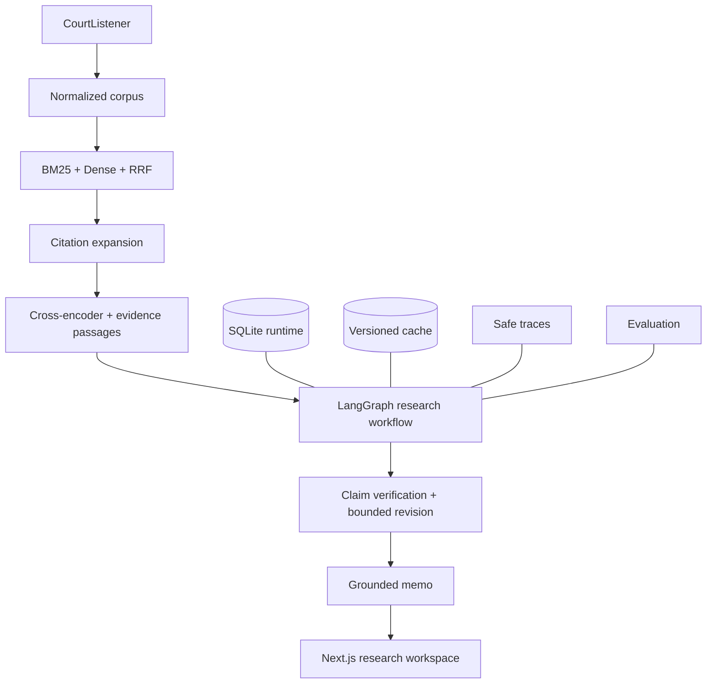

# Architecture

LexTrace v2 adds a private Matter Workspace and Argument X-Ray around the
existing public case corpus, retrieval engine, and research workflow. See
[the v2 architecture and privacy contract](v2-argument-xray.md).

LexTrace is one Python package with synchronous ingestion and retrieval CLI flows
and a FastAPI application. The local research runtime and private matter
workspace persist separately in SQLite; public Case records remain in the
versioned JSONL/index pipeline.

## Implemented ingestion flow

`lextrace ingest-case <cluster_id>` validates a positive integer, lazily reads
`COURTLISTENER_API_TOKEN`, fetches the cluster/docket/opinions, normalizes their
validated response models, and prints a complete internal Case as indented JSON.

- `domain/case.py`: internal Case and Opinion validation and serialization.
- `ingestion/courtlistener.py`: separate external schemas and HTTPX fetching.
- `ingestion/normalize.py`: pure metadata and HTML/plain-text conversion.
- `config.py`: static API base/timeout and ingestion-only credential loading.
- `cli.py`: argument handling, orchestration, JSON output, and safe errors.

A Case represents one decision cluster, with distinct Opinion records. Court IDs
come from docket.court_id. Unknown opinion types remain trimmed source strings;
missing types become `unknown`. No authority classification is inferred.

Validate linked docket/opinion IDs and construct requests against the fixed API
base. Validate the cluster's relative public path before joining it to the fixed
CourtListener origin. Never send credentials to response-provided URLs. Requests
are sequential with explicit timeouts, no redirects, and no retries.

Prefer html_with_citations, removing tags and script/style content while retaining
paragraph boundaries; fall back to plain_text. Missing opinion text fails the
whole command. Errors omit response bodies, credentials, and exception details.

## Research and testing

Unit tests cover models, schemas, links, and normalization. CLI integration tests
exercise HTTPX MockTransport; no external calls or real credentials are needed.
The API health contract remains independent of ingestion credentials.

Version experiment configurations in experiments/configs/. Keep local corpora in
data/ and results in artifacts/, both ignored. Small synthetic responses live in
tests/fixtures/. Ranking, retrieval, and evaluation packages remain placeholders.

## Deferred infrastructure

That initial ingestion slice used no database, external vector store, LLM,
workflow, or frontend; later sections document the systems added afterward.

## Milestone 2: local corpora

`ingestion/corpus.py` coordinates a bounded sequential run. The CourtListener
client lists clusters in ascending ID order, validates each record independently,
and fetches docket/opinion details through one paced client. Pagination links are
validated and only the cursor is copied into a fixed-origin request with the
original filters. Request failures stop; invalid source records are rejected and
recorded using fixed reason codes. Single-case ingestion retains its no-retry
contract and existing text normalization.

`domain/case.py` adds optional reporter_citations to the existing Case. The
CourtListener cluster's structured reporter metadata is formatted as strings;
unknown metadata stays null. There is no second normalized case representation.

`corpus.py` owns canonical JSONL, atomic file replacement, and a versioned
manifest with per-run counters/rejection metadata. Each saved corpus contains
only valid unique cases. Resume validates query compatibility, reads saved IDs,
then replays pagination. Completed records are never refreshed implicitly.
The corpus and manifest are individually atomic, not one transaction; interrupted
success counts are reconciled against saved records on resume. Single writer only.

`evaluation/corpus_quality.py` reads validated JSONL offline and computes corpus
metrics. Ingestion-quality metrics belong in manifest runs and do not alter the
meaning of corpus completeness. Invalid JSONL produces a safe line-number error.
No source-record payloads or credentials are stored in manifests.

All new ingestion tests use HTTPX MockTransport and injected timing functions.
Local output tests use temporary directories; no external data is needed.

## Milestone 3A: Citation-Recovery Benchmark

`evaluation/benchmark.py` defines benchmark records separately from Case objects.
`evaluation/benchmark_build.py` validates frozen citation mappings, reviewed query
spans, positive coverage, temporal bounds, and audit/split requirements; it samples
unjudged candidates by court/year using seeded hashes and publishes a reproducible
bundle. `ingestion/benchmark_sources.py` parses frozen external metadata only.
It performs no acquisition. Existing ingestion and text normalization are intact.

Only candidates.jsonl is eligible for the retrieval index. Full source cases,
weak labels, excerpt removals, and audits are evaluation provenance, not retriever
inputs. Reporter citations remain distinct from opinion-to-opinion relationships.
See [the V1 protocol](benchmark-v1.md) for limitations and metric definitions.

## Milestone 3: acquisition and local baseline

`ingestion/benchmark_acquisition.py` isolates Search/REST resource schemas,
field selection, safe pagination, sequential pacing, quota checks, and a hashed
response cache. `benchmark_job.py` composes these into resumable Case/provenance
inputs. Request failures preserve work; invalid records have explicit rejection
metadata. No new provider abstraction or changes to approved text normalization
were needed. The official bulk citation map was assessed, but its 526 MB snapshot
would not remove the dominant text/metadata REST cost for this pilot.

`evaluation/excerpts.py` proposes source-offset windows and mechanical removals.
The builder distinguishes review_required from reviewed; provisional construction
does not impersonate human review. `audit.json` exposes review work for all queries.
Generation code fingerprints, source/provenance hashes, frozen IDs, fixed cutoff,
and complete positive coverage remain validation requirements.

`retrieval/bm25.py` indexes all stored opinions of each Case in order, using only
text. Its API accepts query ID/text, never labels or source-case metadata.
`evaluation/retrieval_metrics.py` defines binary citation-recovery metrics.
`evaluation/retrieval_run.py` validates the bundle before ranking and writes ignored
run artifacts, split metrics, timings, hashes, and descriptive error flags.
No new runtime dependencies, databases, or model services were added.

## Retrieval Engine v1

`retrieval/documents.py` presents canonical Case records as a stable corpus,
concatenating every stored opinion in order for ranking. `passages.py` splits each
opinion independently into bounded word windows and retains exact source offsets.
The original Case and Opinion objects are unchanged.

`bm25.py` remains the sole lexical implementation. `dense.py` performs exact,
blockwise cosine search over a memory-mapped float32 matrix. `fusion.py` combines
lexical and dense ranks with reciprocal rank fusion. `engine.py` applies metadata
filters before ranking, coordinates all four retrieval modes, optionally reranks
the strongest two lexical evidence passages per case, and returns the common
typed result and trace contracts from `contracts.py`.

`models.py` lazily loads pinned local sentence-transformer models. Embedding input
uses overlapping tokenizer overflow windows represented by token IDs. Window
vectors are unit-normalized, averaged, and normalized; the index builder applies
the same stable mean-and-normalize operation across all passages in a case. This
preserves full long-document coverage without altering source text.

`index.py` publishes a canonical corpus snapshot, numeric document map, optional
dense matrix, and metadata atomically under `artifacts/indexes/`. Metadata records
file checksums, corpus hash/count, exact configuration, model revisions, window
settings, preprocessing/tokenizer/pooling versions, package versions, device, and
backend. Loads reject corrupt files, changed corpora, or incompatible
representation settings. Pickle is never used.

`retrieval/commands.py` exposes build, inspection, search, and benchmark evaluation
commands. `api/app.py` lazily initializes a single process-local engine and exposes
health, typed search, and canonical-case endpoints. Structured search logs omit
query text and include only request identity, query length, candidate counts,
model versions, and timings.

The exact NumPy backend and in-memory lexical corpus suit reproducible small and
moderate local experiments. They are not a web-scale serving architecture.

## Citation intelligence and graph infrastructure v1

`graph/contracts.py` defines backend-independent nodes, directed case edges,
supporting opinion relations, traversal results, and health statistics. The
builder consumes existing `CitationEvidence` and `OpinionMapping` records,
resolves opinion IDs to known clusters, and aggregates supports by case pair.
Unresolved mappings remain counted; self edges remain marked.

`graph/build.py` atomically creates a read-only SQLite store and metadata under
`artifacts/graphs/`. Node, edge, support, and format tables retain court/date and
opinion provenance; incoming/outgoing indexes support traversal. Nodes may lack
local text, so `searchable` records corpus availability. External metadata binds
the database checksum to canonical corpus and evidence hashes.

`graph/store.py` exposes `get_node`, `get_outgoing`, `get_incoming`, `neighbors`,
and bounded `expand`. Traversal is deterministic, cycle safe, limited to one or
two hops, explicitly capped, and optionally filtered by filing date in SQL.
Candidates retain bounded paths from multiple seeds.

`citation_reranked` runs after RRF, expands configured seeds, intersects graph
nodes with the filtered local corpus, and uses the unchanged cross-encoder for
final scoring. Citation edges supply candidates, never ranking scores. Structured
diagnostics explain graph discovery while passages remain exact retrieval evidence.

## Grounded research orchestration

`research/workflow.py` is a bounded LangGraph state machine over the public
`LexTraceRetriever`, `CitationGraph`, and `CaseStore` interfaces. Its 13 nodes
cover issue spotting, planning, retrieval, citation lookup, precedent analysis,
two evidence-sharing argument perspectives, synthesis, atomic claim extraction,
verification, one possible revision, final verification, and finalization.
Search and graph algorithms remain outside the graph.

State carries the request/run ID, bounded issues and tasks, deduplicated evidence,
relationships, analyses, arguments, memo, claims, verification results, grounding,
safe errors/warnings, node timings, prompt identities, retrieval trace IDs, and
revision count. Evidence context preserves canonical metadata and stable passage
IDs under a deterministic word budget; it never silently summarizes source text.

`research/llm.py` defines a provider-independent structured-generation protocol
and a thin OpenAI-compatible adapter with explicit model, timeout, deterministic
temperature, bounded transient retries, safe errors, and token accounting.
`prompts.py` keeps nine prompt definitions at version `1.0.0` and labels legal
text as untrusted data. Tests inject deterministic fakes and never call a provider.

Grounding combines evidence-only structured verification with checks for retrieved
case and passage existence, passage ownership, canonical metadata/source URL, and
run-local provenance. Failed checks override a model's supported decision. One
revision can remove or weaken weak claims; any remaining unsupported claims are
reported in warnings and memo uncertainties. Confidence follows final support
coverage and is explicitly heuristic rather than statistically calibrated.

Run state is returned in a typed trace. `research/evaluation.py` reports
deterministic grounding, workflow, efficiency, and optional labeled-retrieval
metrics, with a separate interface for future human evaluation.

## Engineering v1 runtime

The production runtime persists runs, node summaries, evidence references,
verification outcomes, safe traces, and optional final content in SQLite. A
bounded in-process executor owns workflow concurrency and supports explicit retry
of failed/degraded stored requests. This is a local queue boundary that can be
replaced later; it is not a distributed worker system.

The structured-task cache hashes workflow, prompt, provider/model, schema, and
normalized context. SQLite transactions make concurrent writes atomic. Corrupt
entries are deleted and recomputed. Final answers are never keyed only by question
text. Structured events contain IDs, counts, versions, status, and latency, but no
questions, prompts, evidence text, credentials, or hidden reasoning.

## Precedent intelligence v1

Private Matter claim → resolved seed authority → immutable case citation graph
→ bounded earlier/later neighborhood → exact local citing-opinion context →
conservative treatment annotation → evidence-backed doctrine events → argument
impact. The existing graph database remains format 1 and read-only. The Matter
runtime database adds versioned annotation and derived-analysis tables; raw
`CitationEdge` records are never overwritten. Claim edits and human treatment
review invalidate only that claim's derived doctrine cache.

`graph/courts.py` centralizes known federal court IDs and hierarchy. A hierarchy
category describes institutional position; it is not a relevance score or proof
that an opinion governs a particular issue. `graph/intelligence.py` reuses the
existing graph and paragraph passage IDs. It reports unrecoverable contexts and
local-corpus gaps instead of inferring treatment from bare citations. See
[precedent intelligence documentation](v2-precedent-intelligence.md).

## Living Matters monitoring v1

Private Matter claims and authorities become bounded monitoring targets. Manual
`refresh-monitoring` reuses CourtListener ingestion, publishes an immutable
Case snapshot, and explicitly rebuilds local index/graph views. Deterministic
corpus and watched-authority graph deltas feed bounded BM25/citation screening.
Exact passages and prior Matter state reach an optional structured impact judge;
case, passage, treatment, and run provenance are then checked before events
become alerts. Lawyer review controls application to one claim and targeted
derived-cache invalidation. No-change is a valid result. See
[monitoring documentation](v2-living-matters.md) for versioning, review rules,
CPU Docker configuration, and limits.
