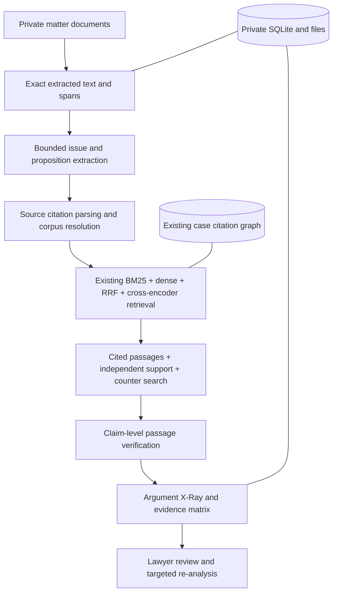

# Matter Workspace and Argument X-Ray v1

LexTrace v2 treats uploaded litigation documents as private, untrusted matter
data. They are separate from the public CourtListener Case corpus. This release
adds no legal-outcome prediction, treatment inference, or doctrine timeline.

## Source and authority provenance

Uploads accept PDF with extractable text, DOCX, UTF-8 TXT, and Markdown up to
10 MB. Scanned or effectively empty PDFs receive `OCR_REQUIRED`; there is no
silent OCR. Extracted text is stored verbatim, with a document SHA-256 hash,
stable section IDs, paragraph order, character offsets, and PDF page labels.
Model-proposed claims are accepted only when the exact quote occurs in the
specified source section. The normalized proposition is a separate editable
field; source text never changes during review.
Analysis currently covers at most the first 24 paragraphs and 20,000 extracted
characters. A partial-coverage warning appears on the document and findings;
later text must be reviewed separately.

Reporter citation strings are parsed from source text and preserved exactly.
Resolution uses exact normalized reporter metadata in the local Case corpus and
reports `RESOLVED`, `AMBIGUOUS`, or `NOT_FOUND`; citation presence alone is never
evidence of support. Cited-case passages use the existing passage selector.
Independent supporting and counter-research use the existing reranked retrieval
contract, including citation expansion when the local citation graph is present.
Every case, opinion, passage, URL, and retrieval trace ID in an X-Ray
finding comes from that contract or the canonical Case corpus. The verifier may
label only supplied passage IDs; invented IDs are discarded.

## Interpretation and review

`STRONG` requires both cited support and support from a distinct independently
retrieved case, with no
unresolved citation. `MIXED` means partial or incomplete support. A verified
contradictory passage makes a claim `VULNERABLE`. `UNSUPPORTED` means searched
passages do not support it; `INSUFFICIENT_EVIDENCE` means no usable passage,
unresolved citation, an unassessable passage, or unfinished research. These are transparent local-corpus
coverage heuristics, not calibrated legal strength scores. Counter-authorities
are shown only when a retrieved passage is verified as contradictory.

The evidence matrix filters by issue or status and opens a claim detail with
highlighted source text and exact case-law passages. Edits retain the original
quote, clear the affected finding, and require targeted re-analysis. Pin/remove
actions affect the matter's review view; they do not alter canonical Case data.

## Privacy and operations

Matter metadata, analysis, and jobs are in SQLite at `LEXTRACE_MATTER_DB`.
Uploaded originals, extracted text, and matter-scoped structured cache live at
`LEXTRACE_PRIVATE_MATTER_ROOT`; Docker mounts both into the runtime volume.
These paths are ignored by Git. API clients provide generated IDs, never file
paths. Deletion rejects active jobs, then removes database rows and the matter's
private directory, including its cache. Document content is not logged in
application traces. Model calls send bounded excerpts to the configured provider;
review its data policy before uploading confidential client material. No public
authentication or multi-tenant isolation is provided in this local demo. Do not
expose the backend to the internet or upload privileged documents to a shared
instance.

`POST /matters/{id}/documents/{document_id}/analyze` returns a job ID. Poll
`GET /matters/{id}/jobs/{job_id}`, then inspect `/issues`, `/claims`, and
`/argument-xray`. `PATCH /matters/{id}/claims/{claim_id}` edits a proposition or
marks it irrelevant; `POST .../reanalyze` reruns one claim. For a repeatable
local demo, use a synthetic document and an existing ignored local case index.
